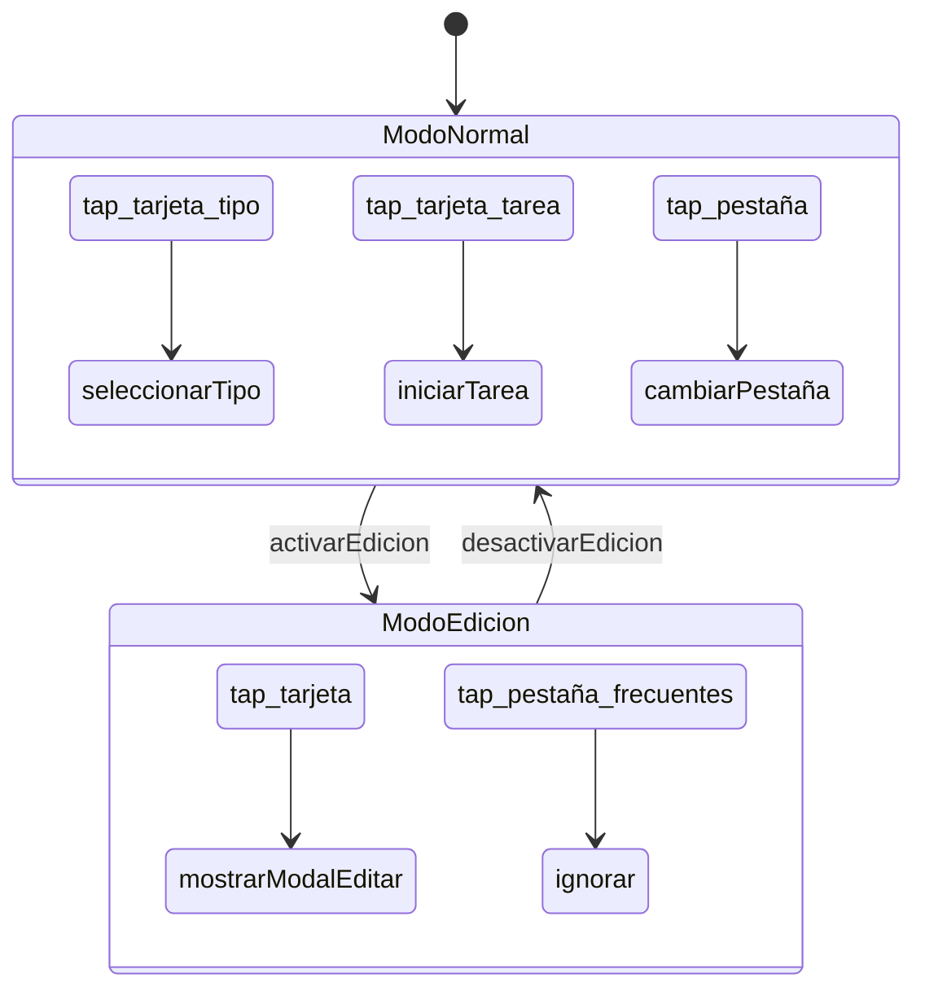

# Metáfora de circuitos: topología como restricción

**Fecha**: 4 de marzo de 2026

---

## La metáfora

Un circuito electrónico tiene tres elementos:

- **Componentes pasivos** — resistencias, condensadores: no amplifican ni
  deciden, pero condicionan el comportamiento del sistema.
- **Componentes activos** — transistores, amplificadores: tienen capacidad
  pero no utilidad fuera de un contexto.
- **Interconexiones** — la topología del circuito: la restricción que
  otorga a los componentes activos la capacidad de resolver la utilidad
  que busca el usuario.

Un transistor fuera de un circuito tiene capacidades pero no tiene utilidad.
La topología no *describe* lo que hacen los componentes — hace que sean útiles.

---

## Implicación para helix

El DSL de helix no es un lenguaje que describe comportamiento.
Es un lenguaje que describe **restricciones de conexión**.

El comportamiento emerge de las restricciones, exactamente igual que en un
circuito. Un Context DCI es una topología: define qué roles pueden conectarse
con qué eventos y qué acciones. Los objetos del dominio (Data) son los
componentes activos — tienen capacidad pero no utilidad hasta que la topología
los conecta.

Los condicionales dispersos — el bug original que motivó helix — son el
equivalente a un cortocircuito: una conexión que la topología no debería
permitir pero que nadie impide porque la topología no está explícita.

---

## Dos representaciones del mismo artefacto

Un circuito tiene dos representaciones canónicas del mismo artefacto:

- **Netlist** — texto, lo que procesa el compilador o el fabricante.
- **Esquemático** — gráfico, lo que lee el ingeniero para razonar sobre
  el diseño.

Ninguna es más "real" que la otra. Son proyecciones distintas de la misma
topología.

Helix debería tener exactamente eso.

### Representación textual (netlist)

```
context ModoEdicion:
    role tarjeta:
        on tap → mostrarModalEditar
    role pestaña_frecuentes:
        on tap → ignorar

context ModoNormal:
    role tarjeta_tipo:
        on tap → seleccionarTipo
    role tarjeta_tarea:
        on tap → iniciarTarea
    role pestaña:
        on tap → cambiarPestaña
```

### Representación gráfica (esquemático)

Generada automáticamente desde la netlist, usando Mermaid:



---

## Por qué Mermaid

- Es texto plano — vive bien en un repositorio git, se versiona, se difea.
- GitHub lo renderiza directamente en el navegador.
- Está ampliamente representado en el corpus de entrenamiento de los LLMs:
  pueden razonar sobre el diagrama y sobre el texto con igual soltura,
  y pueden generar ambos.
- La generación es bidireccional: textual → gráfico y gráfico → textual,
  lo que permite que el usuario trabaje en la representación que prefiera
  en cada momento.

---

## La tercera hebra de la hélice

La representación gráfica no es decorativa. Es una tercera hebra:

1. **Implementación** — el código generado.
2. **Tests** — los casos de prueba generados.
3. **Esquemático** — la topología visible.

La tercera hebra hace imposible olvidar un caso porque los huecos en la
topología son **visualmente obvios**. Un estado sin manejador para un evento
es una conexión abierta en el esquemático — salta a la vista antes de que
sea un bug en producción.

---

## Relación con las otras metáforas

Las tres metáforas describen el mismo artefacto desde perspectivas distintas:

| Metáfora | Énfasis |
|----------|---------|
| Doble hélice (ADN) | Consistencia entre artefactos generados |
| DCI (Reenskaug) | Separación de responsabilidades, traceabilidad |
| Circuito electrónico | La restricción como fuente de utilidad, dualidad texto/gráfico |

No son alternativas — son complementarias. El diseño de helix puede apoyarse
en las tres según qué aspecto se esté comunicando y a quién.
